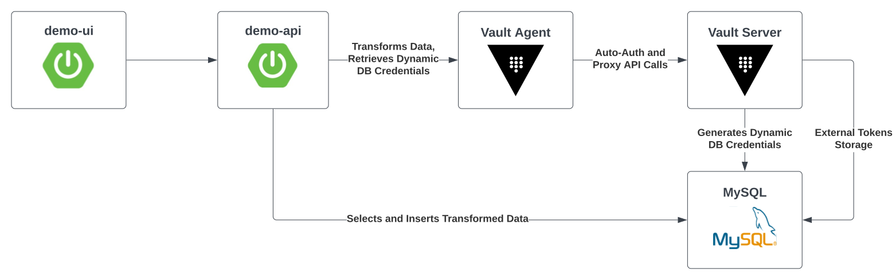

# Vault Transform Secrets Engine Demo



- demo-ui is a simple single page application built with Spring Boot
- demo-api is a Spring Boot application that exposes a REST API for the demo-ui.
  - It calls the Vault agent to transform sensitive data and store the transformed data in MySQL
  - It uses the Spring Cloud Vault library to integrate with the Vault API, i.e. to retrieve dynamic database credentials.
- Vault agent act as a sidecar proxy here to retrieve secrets from Vault. 
  - Auto-auth is used to handle the login to Vault and the renewal of the Vault auth token. Using auto-auth removes the responsibility of managing the auth token from the client application, making it easier for application to consume Vault’s API.
  - Vault agent is optional in this case since Spring Cloud Vault library has the ability to authenticate to Vault.
- On the Vault server side 3 secrets engines are enabled: database, transform, and transit
  - The database secrets engine integrates with MySQL to generate dynamic DB credentials for the demo-app
  - The transform secrets engine is configured to use MySQL as an external token storage for tokenization

# Prerequisites
- [Docker Desktop](https://www.docker.com/products/docker-desktop/)
  
# Run

```shell
# export Vault license
export VAULT_LICENSE=$(cat ~/Downloads/vault.hclic)     

# Start all containers
make all

# open demo-ui
make ui

# Login to Vault as admin
export VAULT_ADDR=http://localhost:8200
vault login --method=userpass username=admin password=passw0rd
```

# Useful commands
```shell

# login to mysql and show table schema
docker exec -it mysql sh
mysql -uroot -ppassw0rd
use demo;
describe users_tokenization;

# build demo-api spring boot app
make build-api

# run demo-api spring boot app locally
make run-api

# build demo-api app docker image
make build-docker-api

# build demo-ui spring boot app
make build-ui

# run demo-api spring boot app locally
make run-ui

# build demo-api app docker image
make build-docker-ui
```

# Reference
- [Vault Transform Demo](https://github.com/tkaburagi/vault-transformation-demo/tree/master)
- [Vault Transform Tutorial](https://developer.hashicorp.com/vault/tutorials/adp/transform)
- [Vault Tokenization Tutorial](https://developer.hashicorp.com/vault/tutorials/adp/tokenization)
- [Vault Transform Secrets Engine API](https://developer.hashicorp.com/vault/api-docs/secret/transform#transform-secrets-engine-api)
- [Vault Demo by Nicholas Jackson](https://github.com/nicholasjackson/demo-vault)
- [Spring Cloud Vault](https://cloud.spring.io/spring-cloud-vault/reference/html/#_quick_start)